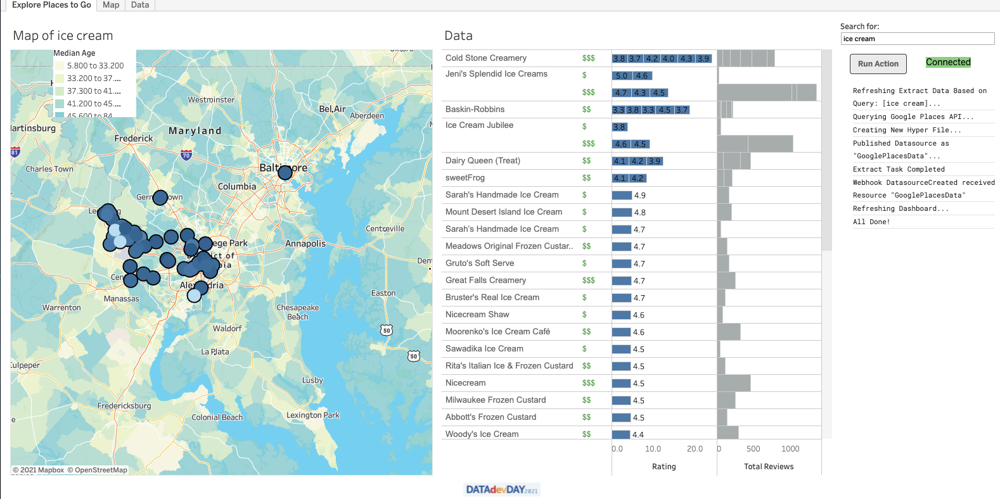

# Tableau Refresh Extract Extension 

## Description

This is a Tableau Dashboard Extension that demonstrates the power of combining Tableau APIs to solve problems. This extension creates a Hyper Extract containing Google Places Data, publishes the fresh extract and refreshes the dashboard using that datasource, all with a click of a button. 

For example, when the query text 'ice cream' is supplied, the Google Places API will return a list of places matching that search term and the new extract will contain only 'ice cream' places. 

In the screenshot below, the extension is shown on the right pane. 



There are two primary components to this application: 

1. A Python command line utility that performs the refresh of the Hyper Extract using the Tableau Hyper API. 
   - Data is obtained via a call out to the Google Places API
   - The utility uses Tableau Server Client (TSC) to publish the fresh Hyper Extract back to the Tableau Server. 
2. A Flask web application that serves as the Tableau Dashboard Extension. 
   - Uses the Tableau Dashboard Extension API to 'get' the query text from the Tableau Dashboard parameter 
   - Executes the refresh utility which creates a new extract and publishes the data source back to Tableau Server
   - Uses Tableau Webhooks to call a refresh on the Tableau Dashboard once the extract is ready for use
   - Uses SocketIO to receive updates in real time 

## Requirements

- Python 3.9+
- [Tableau Server Client](https://github.com/tableau/server-client-python)
- [Tableau Hyper API](https://help.tableau.com/current/api/hyper_api/en-us/docs/hyper_api_installing.html)
- [Tableau Extensions API](https://tableau.github.io/extensions-api/)
- [Google Places API](https://developers.google.com/maps/documentation/places/web-service/overview)

# Installation / Deployment

1. After cloning the repository you will need to run this command. This will install all necessary dependencies.
  - ``pip install -r requirements.txt``

2. Create your configuration file and place in `config` directory (more info below)
  - this will require Tableau Server credentials
  - this will require a Google Places API Key

3. Run the *refresh_extract* utility (manually via the command line) to create the `GooglePlacesData` data source
   
4. Deploy your Flask Web Application (Dashboard Extension)
   
5. Open the Example Tableau Workbook in Tableau Desktop. 
  - Fix the Data source connection so it points to the `GooglePlacesData` on your Tableau Server
  - Add the Extension to your Dashboard using the TREX File (i.e. 'https://datadev-dashext.herokuapp.com/')
  - Note: You will need to allow the Extension URL in your Settings for the Tableau Server Site

6. Publish the Tableau Workbook to your Tableau Server
   
7. Create a [Tableau Webhook](https://help.tableau.com/current/developer/webhooks/en-us/)
    - Webhook for event type `DatasourceCreated`
    - Webhook URL should hit the `/incoming` route on your web application. 
    (i.e. 'https://datadev-dashext.herokuapp.com/incoming')

8. Test it out!


## [Component 1] - refresh_extract utility

This is a python-based command line utility that performs the refresh of the Hyper Extract using the Tableau Hyper API. 

The dashboard extension calls this utility directly via the `refresh_extract.main.embedded_start()` function. However, the utility can also be called via the command line. 

Regardless of how this utility is executed, the configuration file must be in place. 

### Configuration File

The application uses a configuration file. It expects this file to be at this file path `./config/config.yaml`. 

The configuration file is what defines which Tableau Server and Tableau Site to execute the user action against. This is also where the authentication information is stored. 

The `config` directory contains a config-sample.yaml file that can be used as a template for creating a configuration file. 

The path to the configuration file can also be specified via the command line argument `-c` if you would like to reference a file in the non-default location.

```shell
python refresh_extract/main.py -c ./config/myconfig.yaml ...
```

### Handling API Secrets

The refresh extract utility will accept environment variables in lieu of plain text secrets in the configuration file. Specified as follows:

```yaml
...
access_token_id: $TABLEAU_ACCESS_TOKEN_ID
access_token_secret: $TABLEAU_ACCESS_TOKEN_SECRET
...
  
google_maps_api_key: $GOOGLE_MAPS_API_ID
google_maps_api_secret: $GOOGLE_MAPS_API_SECRET
```

In the config.yaml snippet above the environment variable `$TABLEAU_ACCESS_TOKEN_ID` will be used to set the value of the configuration entity `access_token_id`. 

Please note that the `$` character is just symbol that indicates the value is an environment variable rather than a literal value. 
This means that you should use the same syntax (i.e. `$ENV_VAR_NAME`) whether in Windows or Linux. 

### Command Line Arguments

Here is the usage printout for the script describing the command line arguments. 

```sh
usage: main.py [-h] [--config-file CONFIG_FILE] [--server SERVER] [--site SITE] [--username USERNAME] [--password PASSWORD] [--access-token ACCESS_TOKEN] [--token-secret TOKEN_SECRET] --query-text QUERY_TEXT

Tableau Extract Refresher for Google Places.

optional arguments:
  -h, --help            show this help message and exit
  --config-file CONFIG_FILE, -c CONFIG_FILE
                        configuration file for application
  --server SERVER, -s SERVER
                        Tableau Server Host URL
  --site SITE, -t SITE  Tableau Site ID
  --username USERNAME, -u USERNAME
                        Tableau Username
  --password PASSWORD, -p PASSWORD
                        Tableau Password
  --access-token ACCESS_TOKEN, -x ACCESS_TOKEN
                        Tableau Personal Access Token Id
  --token-secret TOKEN_SECRET, -y TOKEN_SECRET
                        Tableau Token Secret
  --query-text QUERY_TEXT, -q QUERY_TEXT
                        Google Places Search Query String
```

The following defaults for the command line arguments are in place:
* Default Config File Path is `./config/config.yaml`
  * Use the `-c` argument to specify a different path
* Default Logging Level for the Console is set to INFO. 
  * Use the `-ll` argument to specify a different level
  * *Note:* Logging Level for the Log File (`./logs/app.log`) is set to DEBUG. This is not configurable via the command line.
  
### EXAMPLE - Executing the Refresh Extract script 

The command to refresh the Tableau Hyper File with new Google Places data based on query text is below.

```shell
python refresh_extract/main.py -q "mexican food"
```
In the above command we are specifying that the logging level should be set to DEBUG. 

In addition the *query text* `-q` is 'mexican food'. This means that the data contained in the hyper file should be a list of places matching that query text.   

Remember that the configuration file is what defines which Tableau Server and Tableau Site to execute the action against. 

## [Component 2] - Flask Web Application (Dashboard Extension)

This is a Flask web application that serves as the Tableau Dashboard Extension.

The flask web application entry point is `app.py`.

The `gunicorn` WSGI HTTP Server can be used to serve the Flask application. 

Use the following command to start the web application:

`gunicorn -k geventwebsocket.gunicorn.workers.GeventWebSocketWorker -w 1 app:app`

### Heroku Deployment

The dashboard extension web application must be deployed to a server accessible to your Tableau Server.

The `Procfile` is in place in the event that you choose to deploy this dashboard extension to Heroku.  This file will be needed by your Heroku Deployment as it describes how to start your application once deployed.

### Adding the Extension to a Tableau Dashboard

The TREX file contained in this repository is a simple XML file that provides the information Tableau needs to deploy the Dashboard Extension web application. 

An example file is contained here: [Tableau-DataDev-Extension.trex](files/Tableau-DataDev-Extension.trex)

To use the TREX file to deploy the extension, you will want to update (at minimum) line 10 `<url>` to point to the deployment location of the Flask application. 

More information on TREX files: [https://tableau.github.io/extensions-api/docs/trex_manifest.html](https://tableau.github.io/extensions-api/docs/trex_manifest.html)

### Create a Webhook to Capture Datasource Events

The dashboard extension web application has an `/incoming` route for capturing web hook events. This route checks to see if the incoming web
hook event matches these values:
* event_type == 'DatasourceCreated'
* resource_name == 'GooglePlacesData'

The extension knows *when* to refresh the data on the dashboard, based on when the webhook event is received. 

You will need to register the webhook on your Tableau Server.

- Webhook for event type `DatasourceCreated`
- Webhook URL should hit the `/incoming` route on your web application (i.e. 'https://datadev-dashext.herokuapp.com/incoming')


## Authorship and Distribution

Developed by Tableau Professional Services for DEMO PURPOSES ONLY

Katie Macpherson - [kmacpherson@tableau.com](mailto:kmacpherson@tableau.com)


